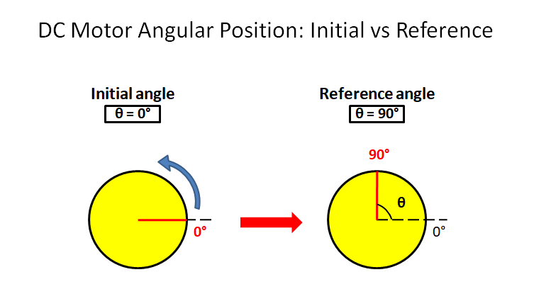
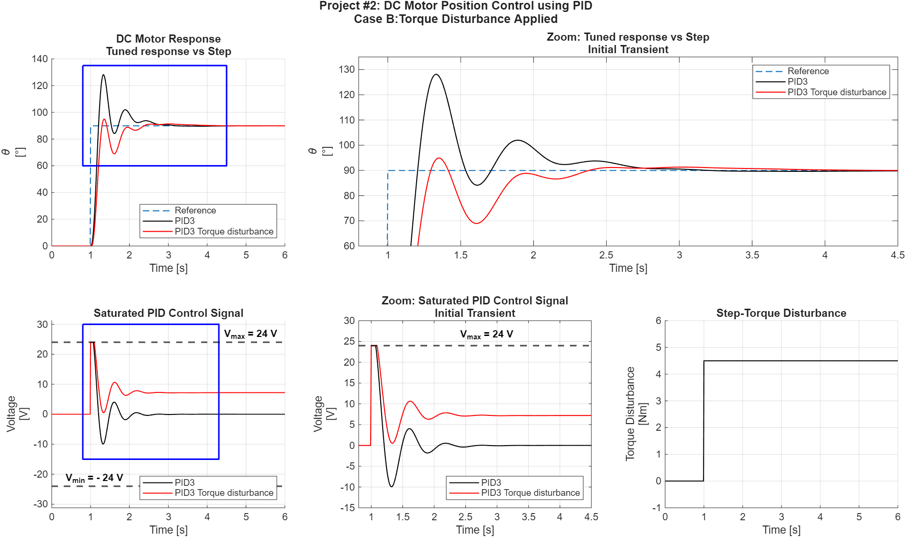

# DC Motor PID Position Control of a Robotic Arm
PID-based position control of a robotic arm driven by a DC motor, implemented in MATLAB/Simulink with simulation data analysis in Python.

## Project Overview
This project implements a **PID controller** for **angular position control of a robotic arm** driven by a DC motor using MATLAB and Simulink.  
The goal is to rotate the arm **90°** accurately. Simulation data are analyzed in **Python**.
This project demonstrates:
- Modeling a DC motor for position control
- PID controller design and tuning
- Simulation in Simulink
- Data analysis in Python

**Figure 1 – DC motor rotor model**

---
## System Model

The DC motor and robotic arm are modeled using standard equations.

**Electrical equation:**

$$
V(t) = L \frac{di(t)}{dt} + Ri + K_b \frac{d\theta(t)}{dt}
$$

**Mechanical equation:**

$$
J \frac{d^2 \theta(t)}{dt^2} + b \frac{d\theta(t)}{dt} = K_t i(t) + T_{ext}(t)
$$

Where: 

- $$\ \theta(t) \$$ = angular position of the arm [rad]  
- $$\ \frac{d\theta}{dt} \$$ = angular velocity [rad/s]  
- $$\ \frac{d^2\theta}{dt^2} \$$ = angular acceleration [rad/s²]  
- V(t) = input voltage  
- i(t) = armature current  
- J = rotor inertia  
- b = viscous friction  
- R, L = armature resistance and inductance  
- $$K_t$$ = motor torque constant  
- $$K_b$$ = back EMF constant  
- $$T_{ext}(t) \$$ = external torque (0 if no load)

The **angular position θ(t)** of the arm is obtained by integrating the angular velocity ω(t).

---

## Control Strategy

A **PID controller** regulates the angular position of the arm.

**PID law:**

$$
u(t) = K_p e(t) + K_i \int e(t) \ dt + K_d \frac{de(t)}{dt}
$$

Where:
- e(t) = $$θ_{desired}$$ - $$θ_{actual}$$ (position error)  
- $$K_p$$ = proportional gain  
- $$K_i$$ = integral gain  
- $$K_d$$ = derivative gain

##### PID Coefficients Sets Tested

Three sets of PID coefficients were tested for the robotic arm:

| Set | Kp  | Ki | Kd |
|-----|-----|----|----|
| 1   | 30  | 2  | 5  |
| 2   | 50  | 1  | 8  |
| 3   | 20  | 4  | 2  |

### Simulation Cases
1. **No external torque** – the controller compensates only for motor inertia and friction (using **three different sets of PID coefficients**).  
2. **With external torque** – the controller compensates for disturbances or a payload applied to the arm. This tests robustness and disturbance rejection (using **only PID set coefficients n.3 after demonstrating its robust and stable behavior**).

---

## Simulink Model

The Simulink model includes:
- DC motor dynamics  
- Angular position feedback  
- PID controller block  
- Step input to command **90° rotation**

---

## Results

Simulation results show:
- **Position response** over time  
- **Control voltage signal**  
- Comparison between no-load and external torque cases

Typical performance metrics:
- Rise time
- Overshoot  
- Steady-state error

Graphs and screenshots are stored in the `results/` folder.

**Figure 2 – DC Motor PID: Torque Disturbance**

**Case 1: No external torque**

| Case         | Rise Time [s] | Overshoot [°] | Overshoot [%] | Steady-State Error [°] |
|--------------|---------------|---------------|---------------|-----------------------|
| PID1 no load  | 0.12          | 50.32         | 55.9          | -0.01                 |
| PID2 no load  | 0.12          | 69.63         | 77.4          | -0.01                 |
| PID3 no load  | 0.13          | 38.21         | 42.5          | -0.01                 |

**Case 2: With torque disturbance**

| Case        | Rise Time [s] | Overshoot [°] | Overshoot [%] | Steady-State Error [°] | Mean Steady-State Voltage [V] |
|------------|---------------|---------------|---------------|-----------------------|-------------------------------|
| PID3 no load | 0.13          | 38.21         | 42.5          | -0.01                 | 0.0                           |
| PID3 load          | 0.13          | 4.99          | 5.5           | 0.02                  | 7.2                           |
---

## Observations from Simulations

From the simulations, we can deduce:

- The PID controller successfully drives the arm to the **90° target** with different overshoot in no-load case depending on PID coefficients set applied.
- When an **external torque** is applied, the controller still stabilizes the position, demonstrating robustness.
- The proportional term mainly affects the speed of response, the integral term reduces steady-state error, and the derivative term helps limit overshoot.
- Slight overshoot may occur depending on PID tuning, but settling is generally fast and stable.
- The control signal (voltage) stays within practical limits, indicating the controller is realistic for physical implementation.

These observations confirm that the **PID position control strategy** is effective for a robotic arm, even under moderate disturbances.

---

## Tools Used

- **MATLAB / Simulink** – for modeling, simulation and plotting
- **Python** – for analyzing simulation data

---

## Possible Improvements

- Automatic PID tuning (using MATLAB PID Tuner)  
- Implementation of feedforward control  
- Real hardware testing on robotic arm  
- Extended simulations with varying loads and disturbances

---

## Repository Structure

The repository contains:

| Folder   | Contents                         |
| -------- | -------------------------------- |
| model/   | Simulink model (.slx)            |
| scripts/ | MATLAB and Python parameter scripts         |
| results/ | Simulation plots and screenshots |
| docs/    | .csv files     |
